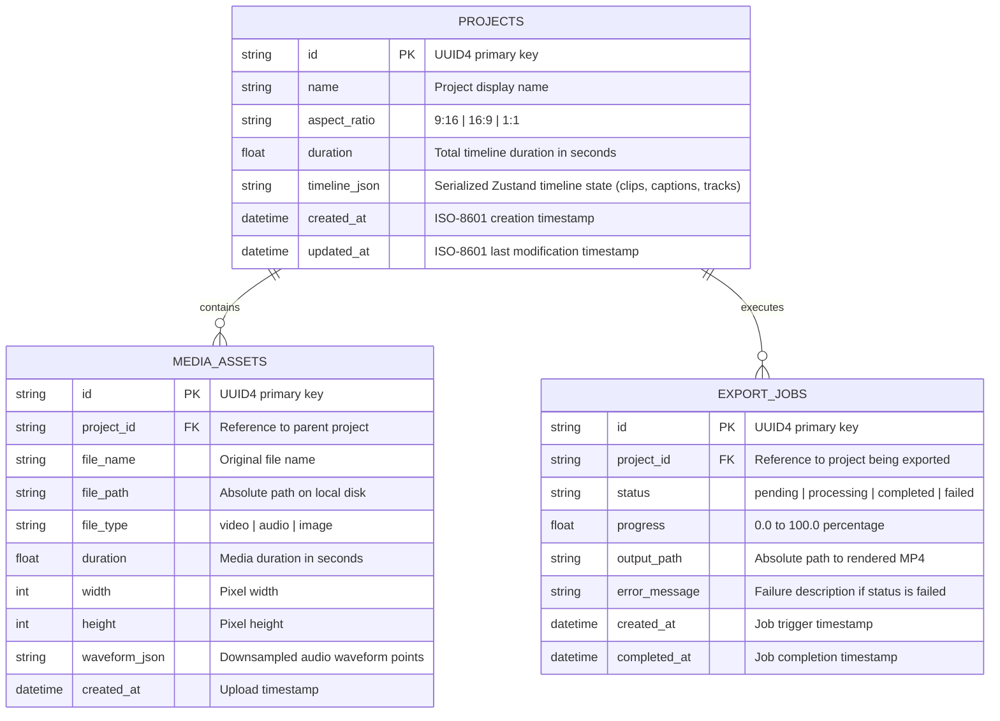
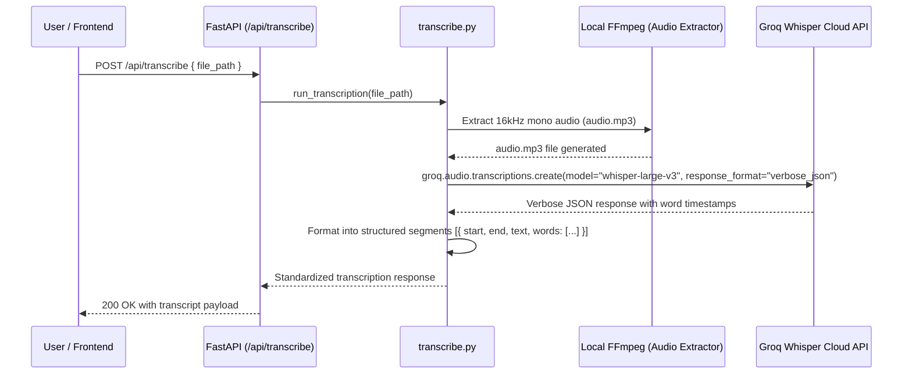
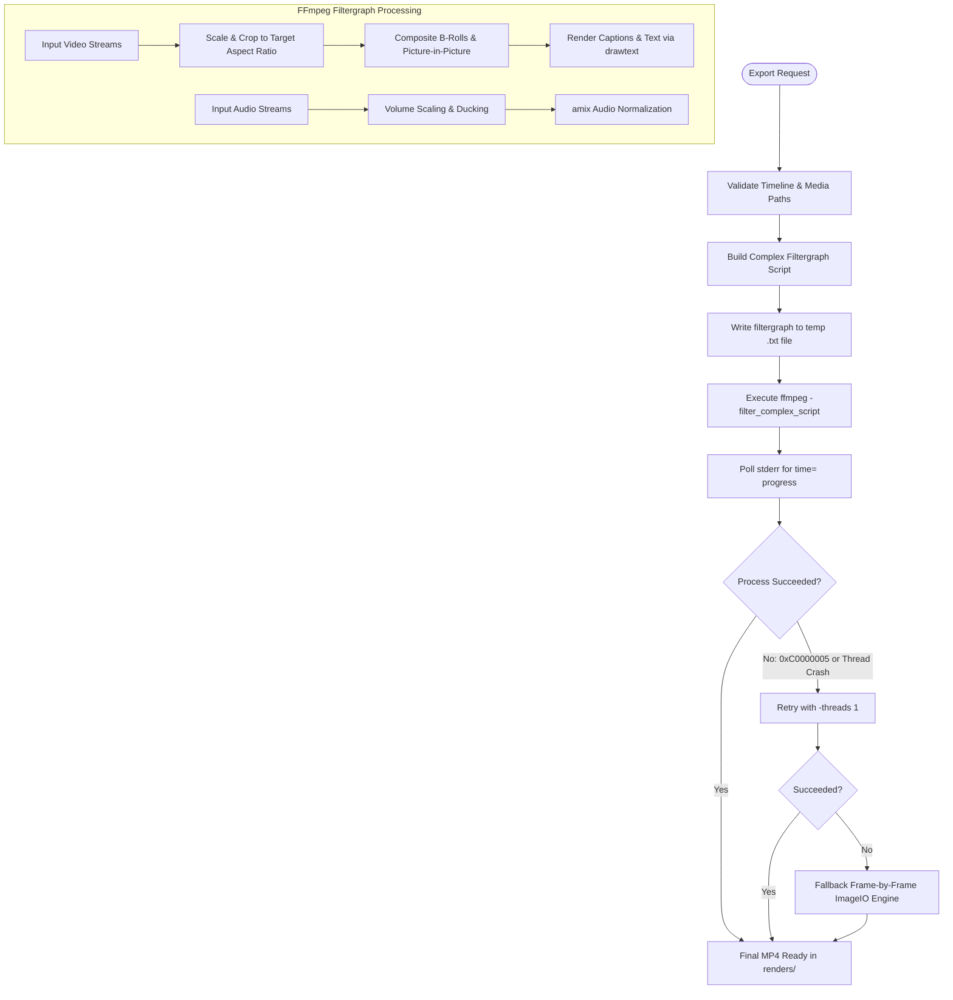
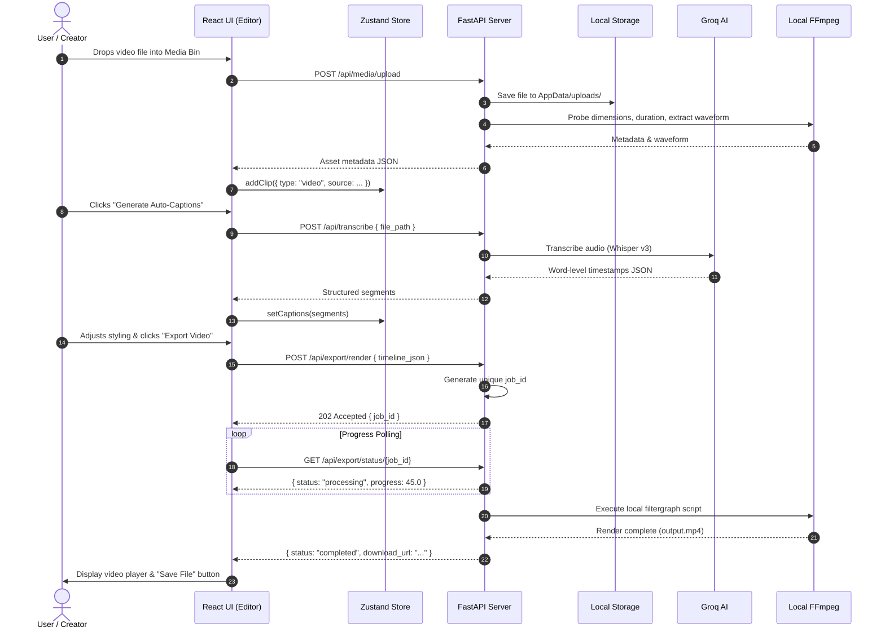

# System Architecture & Technical Specification
## AI Short-Form Video Editor

---

## 1. Executive Summary & System Overview

The **AI Short-Form Video Editor** is a hybrid desktop application engineered to automate the generation, intelligent editing, captioning, and export of short-form vertical (9:16), horizontal (16:9), and square (1:1) video content.

### Architectural Philosophy
* **100% Local Render Pipeline:** Zero third-party cloud render dependencies (e.g. no Shotstack or cloud render APIs). Video rendering, text rasterization, audio normalization, and multi-track compositing run entirely on the local machine via bundled FFmpeg binaries.
* **Deterministic Typography Parity:** Identical rendering between the frontend HTML5 Canvas / DOM preview and the backend FFmpeg drawtext output via an absolute-path local font registry (`backend/fonts/registry.json`). Fonts bypass system `fontconfig` entirely to eliminate OS font mismatch and Windows crash codes (`0xC0000005`).
* **Hybrid Electron + Standalone Python Architecture:** Electron hosts the modern React/Vite UI in an isolated sandbox. Python FastAPI runs as an isolated background child process (compiled via PyInstaller or run directly via Uvicorn), bound strictly to `127.0.0.1` on a dynamically negotiated free port.
* **Intelligent Media Composition:** Integration with Groq Whisper for near real-time speech-to-text with word-level timestamps, Google Gemini for intelligent script-to-edit decisions (B-roll placement, cut trimming, caption style selection), and Pexels for stock asset retrieval.

---

## 2. High-Level System Architecture

```mermaid
flowchart TB
    subgraph Desktop["Desktop Runtime Environment (Electron / OS)"]
        subgraph ElectronMain["Electron Main Process (Node.js)"]
            EM_Main["main.js"]
            EM_Port["Port Finder (net.createServer)"]
            EM_Spawn["Child Process Spawner (Python Backend)"]
            EM_Term["taskkill / Tree Termination"]
        end

        subgraph RendererProcess["Electron Renderer (Chromium)"]
            UI_App["React 19 + Vite App"]
            UI_Store["Zustand Store (editorStore.js)"]
            UI_Preview["VideoPreview (HTML5 Video + Canvas Overlay)"]
            UI_API["Axios API Client (Dynamic Base URL via Preload)"]
        end

        subgraph IPC["IPC Isolation Bridge"]
            Preload["preload.js (contextBridge.exposeInMainWorld)"]
        end
    end

    subgraph BackendProcess["Python Backend (FastAPI / Uvicorn)"]
        BE_Main["FastAPI App (app/main.py)"]
        BE_Paths["Path Subsystem (app/paths.py)"]
        BE_Settings["Settings Subsystem (app/settings.py)"]
        BE_DB["SQLite Persistence (app/db.py)"]
        BE_Storage["Local File Store (app/storage.py)"]
        
        subgraph Routers["API Routers"]
            R_Projects["/projects"]
            R_Media["/media"]
            R_Transcribe["/transcribe"]
            R_AI["/ai"]
            R_Stock["/stock"]
            R_Export["/export"]
            R_Settings["/settings"]
            R_Fonts["/fonts"]
            R_Templates["/templates"]
        end

        subgraph CoreEngines["Core Processing Engines"]
            E_Transcribe["Groq Whisper Engine (transcribe.py)"]
            E_AI["Gemini AI Editor & B-Roll Policy (ai_edit.py, broll_policy.py)"]
            E_Pexels["Pexels Client (pexels.py)"]
            E_Layout["Caption Layout Engine (caption_layout.py)"]
            E_Fonts["Font Manager (font_manager.py)"]
            E_Render["Local FFmpeg Engine (render.py)"]
        end
    end

    subgraph OS_FS["Host OS File System & Resources"]
        FS_AppData["%LOCALAPPDATA%/AI Video Editor/ (settings.json, app.db)"]
        FS_Binaries["Bundled Binaries (ffmpeg.exe, ffprobe.exe)"]
        FS_Fonts["Bundled Fonts (backend/fonts/*.ttf)"]
        FS_Temp["Scratch Storage (renders/, temp uploads)"]
    end

    subgraph CloudAPIs["External AI & Stock Cloud Services"]
        API_Groq["Groq Cloud API (Whisper Transcription)"]
        API_Gemini["Google Generative AI (Gemini 1.5 / 2.0)"]
        API_Pexels["Pexels Video Search API"]
    end

    %% Wiring
    EM_Port -->|Free Port| EM_Spawn
    EM_Spawn -->|Launches executable/script| BE_Main
    Preload -->|Window.api: getApiUrl, getVersion| UI_API
    UI_API -->|HTTP REST on 127.0.0.1:{PORT}| Routers
    
    Routers --> CoreEngines
    Routers --> BE_DB
    Routers --> BE_Storage
    Routers --> BE_Settings
    
    BE_Paths --> FS_AppData
    BE_Paths --> FS_Binaries
    BE_Paths --> FS_Fonts
    
    E_Transcribe --> API_Groq
    E_AI --> API_Gemini
    E_Pexels --> API_Pexels
    
    E_Render -->|CLI Script Execution| FS_Binaries
    E_Render --> FS_Fonts
    E_Render --> FS_Temp
    
    EM_Main -->|Lifecycle Watchdog & Shutdown| EM_Term
    EM_Term -.->|Kills Process Tree| BE_Main
```

---

## 3. Technology Stack & Runtime Matrix

| Subsystem | Technology / Library | Version / Pin | Purpose / Architectural Role |
| :--- | :--- | :--- | :--- |
| **Desktop Shell** | Electron | ^28.0.0 | Cross-platform container, sandboxed window manager, OS process runner |
| **Electron Runtime** | Node.js | v18+ | IPC bridge, dynamic TCP port negotiation, process tree lifecycle watchdog |
| **UI Framework** | React | ^19.0.0 | Component rendering, virtual DOM reconciliation, state-driven view hierarchy |
| **UI Build Tool** | Vite | ^6.0.0 | Development HMR server and optimized client production bundling |
| **Frontend State** | Zustand | ^5.0.3 | Single-source-of-truth timeline store, undo/redo state, playback control |
| **Icons & Design** | Lucide React | ^0.475.0 | Modern UI icon registry |
| **Styling** | Vanilla CSS + Tailwind | Custom | Responsive layout tokens, dark-mode styling, glassmorphic HUD |
| **HTTP Client** | Axios | ^1.7.9 | REST communication with local FastAPI backend |
| **Backend Framework** | FastAPI | ^0.109.0 | High-performance asynchronous Python REST server with OpenAPI contract |
| **ASGI Server** | Uvicorn | ^0.27.0 | Local loopback HTTP host with asyncio event loop |
| **Data Persistence** | SQLite 3 | Embedded | Local ACID relational database storage via standard Python `sqlite3` |
| **Speech-to-Text** | Groq Python SDK | ^0.4.2 | Word-level speech transcription (`whisper-large-v3`) |
| **LLM Reasoning** | Google GenAI SDK | ^0.1.0 (`google-genai`) | Script parsing, AI timeline layout, B-roll density heuristic execution |
| **Video Engine** | FFmpeg / FFprobe | Static Binaries | Local stream demuxing, filtergraph compilation, drawtext rendering, audio mix |
| **Audio Processing** | PyDub / FFmpeg | ^0.25.1 | Audio extraction, waveform analysis, LUFS loudness normalization |
| **Image Fallback** | Pillow / ImageIO | ^10.2.0 | Frame extraction, image sequence assembly, fallback rendering |
| **Backend Bundler** | PyInstaller | ^6.3.0 | Standalone binary compilation (`backend/build.spec`) |

---

## 4. Repository & Workspace Directory Layout

```
├── backend/
│   ├── app/
│   │   ├── routers/
│   │   │   ├── ai.py             # AI edit, script-to-video, and auto-caption routes
│   │   │   ├── export.py         # Local FFmpeg export jobs, progress polling, file download
│   │   │   ├── fonts.py          # Local font list and direct TTF streaming
│   │   │   ├── media.py          # Asset uploads, audio extraction, waveform endpoints
│   │   │   ├── projects.py       # CRUD project management backed by SQLite
│   │   │   ├── settings.py       # API key management with live module hot-reload
│   │   │   ├── stock.py          # Pexels stock video search and download
│   │   │   ├── templates.py      # Starter template listing and instantiation
│   │   │   └── transcribe.py     # Speech-to-text routes calling Groq Whisper
│   │   ├── ai_edit.py            # Gemini prompt contracts and edit intent parser
│   │   ├── broll_policy.py       # B-roll density placement engine and keyword matcher
│   │   ├── caption_layout.py     # Backend text layout & wrapped line measurement
│   │   ├── config.py             # Application-wide defaults and system settings
│   │   ├── db.py                 # SQLite schema initialization and CRUD helper layer
│   │   ├── font_manager.py       # Font registry resolution & FFmpeg drawtext escaper
│   │   ├── main.py               # FastAPI application setup, CORS, and router registration
│   │   ├── paths.py              # OS-agnostic path resolver (AppData vs Dev root)
│   │   ├── pexels.py             # Async client for Pexels search and asset streaming
│   │   ├── render.py             # Local FFmpeg filtergraph builder & render executor
│   │   ├── settings.py           # Persistent settings model & env-bound hot-reload
│   │   ├── storage.py            # Local asset file persistence and path sanitization
│   │   ├── template_engine.py    # Production-ready short-form video templates
│   │   └── transcribe.py         # Groq Whisper integration with word-level timestamps
│   ├── fonts/
│   │   ├── registry.json         # Master typography registry (font paths, weights, styles)
│   │   └── *.ttf                 # Bundled TrueType font files (Inter, Montserrat, etc.)
│   ├── bin/                      # Platform-specific static binaries (ffmpeg.exe, ffprobe.exe)
│   ├── build.spec                # PyInstaller specification for single-binary backend build
│   ├── requirements.txt          # Python runtime dependencies
│   └── run_server.py             # Uvicorn entry point script for bundled execution
├── electron/
│   ├── main.js                   # Electron main process (port negotiation, child process)
│   ├── preload.js                # Context-isolated IPC bridge exposing window.api
│   └── package.json              # Electron packaging configuration
├── frontend/
│   ├── src/
│   │   ├── components/
│   │   │   ├── common/           # Shared modals, dialogs, button controls
│   │   │   ├── dashboard/        # Project manager, template browser, settings modal
│   │   │   ├── editor/           # Video preview, timeline tracks, inspector panels, sidebar
│   │   │   └── layout/           # Header bar, navigation breadcrumbs, status indicators
│   │   ├── lib/
│   │   │   └── captionLayout.js  # Frontend caption wrapping & Canvas layout parity
│   │   ├── routes/
│   │   │   └── AppRoutes.jsx     # Client-side routing between Dashboard and Editor views
│   │   ├── services/
│   │   │   └── api.js            # Axios client with dynamic baseURL and endpoint methods
│   │   ├── stores/
│   │   │   └── editorStore.js    # Zustand store managing complete timeline state
│   │   ├── App.jsx               # Root React entry component
│   │   ├── index.css             # Design tokens, CSS variables, global styles
│   │   └── main.jsx              # React DOM mounting entry point
│   ├── package.json              # Frontend dependencies and build scripts
│   └── vite.config.js            # Vite bundler configuration
└── ARCHITECTURE.md               # This system architecture specification
```

---

## 5. Electron Shell & Desktop Architecture

### 5.1 Dynamic Loopback Port Negotiation
To prevent port collision with other local services, the Electron main process avoids hardcoded ports.
1. `electron/main.js` creates a temporary Node.js TCP server listening on `127.0.0.1:0`.
2. The operating system assigns an available ephemeral port.
3. Node reads `server.address().port`, closes the socket, and passes the allocated port to the Python process via the `--port` CLI flag.

```javascript
// electron/main.js
const srv = net.createServer();
srv.listen(0, '127.0.0.1', () => {
  const allocatedPort = srv.address().port;
  srv.close(() => {
    startPythonBackend(allocatedPort);
  });
});
```

### 5.2 Subprocess Lifecycle & Tree Termination
* In development mode, `main.js` connects to the local Python virtual environment or existing Uvicorn instance.
* In production mode, `main.js` spawns the compiled PyInstaller binary (`backend-server.exe` on Windows).
* **Process Tree Teardown:** On Windows, normal child process termination leaves orphaned background tasks. When `app.on('before-quit')` triggers, Electron executes:
  ```powershell
  taskkill /pid <backend_pid> /T /F
  ```
  This guarantees that all child threads, FFmpeg child processes, and Python interpreters are completely reaped.

### 5.3 Sandboxed IPC Bridge (`preload.js`)
Chromium renderer processes run with `contextIsolation: true` and `nodeIntegration: false`. The preload script exposes a secure, read-only API object on `window.api`:
* `getApiUrl()`: Returns `http://127.0.0.1:<PORT>`
* `getVersion()`: Returns desktop package version
* `onBackendStatus()`: Subscribes to backend health checks and logs

---

## 6. Packaging & Distribution Pipeline

### 6.1 Backend Compilation (`backend/build.spec`)
The Python backend is packaged via PyInstaller into an isolated binary.
* **Hidden Imports:** Explicitly collects dynamic modules including `fastapi`, `uvicorn.logging`, `uvicorn.loops.auto`, `pydub`, `groq`, and `google.genai`.
* **Asset Bundling:** Embeds `backend/fonts/` (including `registry.json` and all `.ttf` files) and platform binaries in `bin/` (`ffmpeg.exe`, `ffprobe.exe`) directly into the PyInstaller `sys._MEIPASS` runtime container.

### 6.2 Frontend & Electron Installer
1. `npm run build` inside `frontend/` compiles React into static production assets in `frontend/dist/`.
2. `electron-builder` packages:
   * Compiled frontend web distribution
   * Compiled PyInstaller backend folder/executable
   * Node main/preload scripts
3. Outputs an NSIS standalone installer for Windows and DMG/AppImage for macOS/Linux.

---

## 7. Runtime Path Resolution & Storage Subsystem

### 7.1 Path Resolution Contract (`backend/app/paths.py`)
Paths dynamically pivot between Development Mode and Frozen PyInstaller/Electron Mode:

| Path Target | Development Location | Production / Frozen Location |
| :--- | :--- | :--- |
| **App Root** | Root of workspace repo | `sys._MEIPASS` (or executable directory) |
| **User Data** | `.data/` (local workspace folder) | `%LOCALAPPDATA%/AI Video Editor/` |
| **Database** | `.data/app.db` | `%LOCALAPPDATA%/AI Video Editor/app.db` |
| **Settings** | `.data/settings.json` | `%LOCALAPPDATA%/AI Video Editor/settings.json` |
| **Media Uploads** | `.data/uploads/` | `%LOCALAPPDATA%/AI Video Editor/uploads/` |
| **Renders** | `.data/renders/` | `%LOCALAPPDATA%/AI Video Editor/renders/` |
| **Fonts Registry** | `backend/fonts/registry.json` | `<BUNDLED_PATH>/fonts/registry.json` |
| **FFmpeg Binary** | `backend/bin/ffmpeg.exe` or `PATH` | Bundled `bin/ffmpeg.exe` or System `PATH` |

### 7.2 File Storage & Asset Isolation (`backend/app/storage.py`)
* Every uploaded asset is stored under a SHA-256 or UUID hash to avoid path collisions.
* Directory traversals (`../`) are strictly sanitized.
* Path helper `ensure_directories()` guarantees directory existence on application startup.

---

## 8. Settings, Environment, and Live Hot-Reload System

### 8.1 Persistence & Masking (`backend/app/settings.py`, `routers/settings.py`)
* User settings (API keys for Groq, Gemini, Pexels, and custom preferences) are stored in `settings.json` in the user data directory.
* **Security & Secret Masking:** When the frontend requests `GET /api/settings`, all sensitive keys are masked before transmission:
  ```python
  # Returned: "****3a8f"
  masked_key = f"****{raw_key[-4:]}" if len(raw_key) >= 4 else "****"
  ```
* When updated via `POST /api/settings`, fields containing `****` are ignored, preserving the underlying raw secrets on disk.

### 8.2 Dynamic Module Hot-Reloading (`refresh_env_bound_modules()`)
Unlike standard applications requiring a restart after updating API credentials, updating settings immediately triggers `refresh_env_bound_modules()`:
1. Re-injects variables into `os.environ` (`GROQ_API_KEY`, `GEMINI_API_KEY`, `PEXELS_API_KEY`).
2. Live re-instantiates the active Groq client in `backend/app/transcribe.py`.
3. Live re-instantiates the Google GenAI client in `backend/app/ai_edit.py`.
4. Live updates authentication headers in `backend/app/pexels.py`.

---

## 9. Backend Server Architecture & Lifecycle

### 9.1 Application Startup (`backend/app/main.py`)
```python
@asynccontextmanager
async def lifespan(app: FastAPI):
    # 1. Initialize user directories (uploads, renders, cache)
    init_paths()
    # 2. Execute SQLite migrations and table creations
    init_db()
    # 3. Load settings and inject environment variables
    load_settings()
    # 4. Verify local FFmpeg availability and font registry
    verify_ffmpeg_and_fonts()
    yield
    # Teardown logic (close DB pools, clear temp renders)
```

### 9.2 CORS & Local Security
* CORS middleware is configured to allow `localhost`, `127.0.0.1`, and Electron `file://` or custom protocol origins.
* Restricts requests to loopback addresses, preventing malicious local web pages from sending arbitrary commands to the local API.

---

## 10. Database Schema & Persistence Layer (`backend/app/db.py`)

The application utilizes an embedded SQLite 3 database with write-ahead logging (WAL mode enabled for concurrent read/write operations).



---

## 11. REST API Route Directory & Endpoint Contracts

| Path | Method | Purpose | Input / Payload | Output / Response |
| :--- | :--- | :--- | :--- | :--- |
| **`/api/projects`** | `GET` | List all saved projects | Query params (`limit`, `offset`) | Array of project summaries |
| **`/api/projects`** | `POST` | Create new empty project | `{ name, aspect_ratio }` | Full project record |
| **`/api/projects/{id}`**| `GET` | Get project state & timeline | Project ID | Project record with `timeline_json` |
| **`/api/projects/{id}`**| `PUT` | Save project and timeline | `{ name, aspect_ratio, timeline }` | Updated project record |
| **`/api/projects/{id}`**| `DELETE`| Remove project and media | Project ID | `{ success: true }` |
| **`/api/media/upload`** | `POST` | Upload video/audio asset | `multipart/form-data` | Asset metadata (dims, duration, path) |
| **`/api/media/waveform`**| `GET` | Get downsampled audio peaks | `file_path` query | Array of float normalized peaks |
| **`/api/transcribe`** | `POST` | Run Groq Whisper on audio | `{ file_path, language? }` | Word-level timestamped segments |
| **`/api/ai/edit`** | `POST` | Execute Gemini edit intent | `{ project_id, prompt, transcript }`| Timeline delta (cuts, b-rolls, captions) |
| **`/api/ai/auto-caption`**| `POST`| Generate styled captions | `{ transcript, style_preset }` | Formatted caption clip objects |
| **`/api/stock/search`** | `GET` | Search Pexels video clips | Query params (`q`, `orientation`, `per_page`)| Array of video objects with preview URLs |
| **`/api/stock/download`**| `POST`| Download Pexels video | `{ video_url, project_id }` | Local asset metadata |
| **`/api/templates`** | `GET` | List built-in presets | None | Array of template metadata |
| **`/api/templates/apply`**| `POST`| Apply template to project | `{ template_id, project_id }` | New initialized timeline state |
| **`/api/fonts`** | `GET` | List available system fonts | None | Array of fonts from `registry.json` |
| **`/api/fonts/file/{name}`**|`GET`| Stream TTF font file | Font file name | `font/ttf` raw binary stream |
| **`/api/export/render`**| `POST` | Trigger local FFmpeg export | Complete timeline JSON | `{ job_id, status: "pending" }` |
| **`/api/export/status/{job_id}`**| `GET` | Poll render progress | Job ID | `{ status, progress, output_path }` |
| **`/api/export/download/{job_id}`**| `GET` | Stream completed video | Job ID | `video/mp4` binary stream |
| **`/api/settings`** | `GET` | Read current settings | None | Settings with masked secrets |
| **`/api/settings`** | `POST` | Update settings & reload env| Unmasked/partially masked keys | Updated settings confirmation |

---

## 12. Frontend Application Architecture & Routing

### 12.1 Client Routing Matrix (`frontend/src/routes/AppRoutes.jsx`)
* **`/` (Dashboard Route):**
  * Displays project cards, thumbnail previews, creation date, and duration.
  * Direct action buttons: "New Project", "Import Media", "Template Library", "Settings".
* **`/editor/:projectId` (Editor Studio Route):**
  * Dedicated high-density editing environment.
  * Mounts preview canvas, multi-track timeline, media asset bin, AI assistant drawer, and property inspectors.

### 12.2 Component Tree Hierarchy
```
AppRoutes
└── DashboardView
│   ├── HeaderBar
│   ├── TemplateSelectorModal
│   ├── ProjectCardGrid
│   └── SettingsModal
└── EditorView
    ├── EditorHeaderBar (Project title, aspect ratio switcher, export button)
    ├── MainEditingWorkspace (Split layout)
    │   ├── LeftSidebar (Media Bin, AI Tools, Captions, Text, Stock, Audio)
    │   ├── CenterPreviewZone
    │   │   ├── AspectRatioFrame (9:16 / 16:9 / 1:1)
    │   │   ├── VideoPreview (HTML5 Video Element)
    │   │   ├── CanvasOverlay (Rendered captions & dynamic text)
    │   │   └── TransportBar (Play/Pause, Timecode, Scrub bar, Loop)
    │   └── RightInspectorPanel (Clip transforms, caption styling, color grade)
    └── BottomTimelineDock
        ├── TimelineToolbar (Split, Delete, Zoom In/Out, Snapping toggle)
        ├── TimeRuler (Seconds & frame ticks)
        └── TrackContainer
            ├── VideoTrackLayer (Primary A-roll and B-roll overlays)
            ├── CaptionTrackLayer (Auto-caption blocks)
            └── AudioTrackLayer (Background music and sound effects)
```

---

## 13. State Management & Data Store (`frontend/src/stores/editorStore.js`)

The frontend application state is unified within a centralized Zustand store with integrated history recording for undo/redo actions.

### 13.1 Core State Model
```typescript
interface EditorState {
  // Project Metadata
  projectId: string | null;
  projectName: string;
  aspectRatio: "9:16" | "16:9" | "1:1";
  duration: number;
  
  // Playback Engine State
  currentTime: number;
  isPlaying: boolean;
  playbackRate: number;
  isScrubbing: boolean;
  
  // Multi-Track Timeline Data
  tracks: {
    id: string;
    type: "video" | "audio" | "caption" | "text";
    name: string;
    locked: boolean;
    muted: boolean;
  }[];
  
  clips: TimelineClip[];
  captions: CaptionSegment[];
  
  // Selection & UI Flags
  selectedClipId: string | null;
  selectedCaptionId: string | null;
  activeSidebarTab: "media" | "ai" | "captions" | "text" | "stock" | "templates";
  isExporting: boolean;
  exportProgress: number;
  
  // Actions & Mutators
  setCurrentTime: (time: number) => void;
  play: () => void;
  pause: () => void;
  addClip: (clip: TimelineClip) => void;
  splitClip: (clipId: string, splitTime: number) => void;
  removeClip: (clipId: string) => void;
  updateClipTransform: (clipId: string, transform: Partial<Transform>) => void;
  updateCaptionStyle: (style: Partial<CaptionStyle>) => void;
  undo: () => void;
  redo: () => void;
}
```

---

## 14. Timeline Engine & Data Schema

### 14.1 Clip Schema Definition
```json
{
  "id": "clip_broll_9481a",
  "trackId": "track_video_overlay",
  "type": "video",
  "source": {
    "mediaId": "media_pexels_8291",
    "filePath": "C:/Users/DK/AppData/Local/AI Video Editor/uploads/pexels_8291.mp4",
    "width": 1080,
    "height": 1920,
    "sourceDuration": 12.4
  },
  "timeline": {
    "start": 4.25,
    "end": 7.50,
    "duration": 3.25
  },
  "trim": {
    "inPoint": 1.00,
    "outPoint": 4.25
  },
  "transform": {
    "scale": 1.0,
    "positionX": 0.0,
    "positionY": 0.0,
    "rotation": 0.0,
    "opacity": 1.0
  },
  "audio": {
    "volume": 0.0,
    "muted": true
  }
}
```

### 14.2 Aspect Ratio Standards
* **9:16 (Vertical Short-Form):** Canvas target `1080 x 1920`. Primary target for TikTok, YouTube Shorts, and Instagram Reels.
* **16:9 (Landscape Standard):** Canvas target `1920 x 1080`. Target for traditional YouTube and desktop presentations.
* **1:1 (Square Standard):** Canvas target `1080 x 1080`. Target for Instagram feed and LinkedIn carousels.

---

## 15. Local Typography System & Cross-Platform Parity

To prevent Windows font substitution bugs, missing glyph errors, or runtime fontconfig crashes (`0xC0000005`), typography does not depend on system installed fonts or external Google Fonts CDN.

### 15.1 Font Registry (`backend/fonts/registry.json`)
The registry acts as the single source of truth for both frontend and backend:
```json
{
  "fonts": [
    {
      "id": "inter-bold",
      "family": "Inter",
      "weight": "700",
      "style": "normal",
      "fileName": "Inter-Bold.ttf",
      "preview": "Inter Bold"
    },
    {
      "id": "montserrat-extrabold",
      "family": "Montserrat",
      "weight": "800",
      "style": "normal",
      "fileName": "Montserrat-ExtraBold.ttf",
      "preview": "Montserrat ExtraBold"
    }
  ]
}
```

### 15.2 Font Resolution & Path Escaping (`font_manager.py`)
* During rendering, `font_manager.py` resolves font families to their exact absolute file paths:
  ```python
  font_path = get_font_path("Montserrat", weight="800")
  # Returns: "C:/Users/.../backend/fonts/Montserrat-ExtraBold.ttf"
  ```
* **Windows FFmpeg Path Escaping:** Windows backslashes and drive colons (`C:\...`) break FFmpeg filtergraphs. The font manager normalizes paths:
  ```python
  clean_path = font_path.replace("\\", "/").replace(":", "\\:")
  # Output formatted for FFmpeg: "fontfile='C\\:/Users/.../fonts/font.ttf'"
  ```

---

## 16. Caption Layout & Text Rendering Engine

A major challenge in video editors is preventing captions from wrapping differently between the HTML5 preview and the final FFmpeg render. This application enforces deterministic layout calculations.

### 16.1 Twin Layout Algorithm
* **Frontend (`captionLayout.js`):** Measures character bounds using Canvas 2D API (`ctx.measureText`) matching the font size, letter spacing, and line width rules.
* **Backend (`caption_layout.py`):** Mirrors the exact text-wrapping logic and bounding box constraints using PIL/Pillow font metric measurements.

### 16.2 Caption Style Models
* **Karaoke / Word-Highlight:** Active words dynamically shift color (e.g. from white `#FFFFFF` to bright yellow `#FFE600`) as the audio playhead progresses across word timestamps.
* **Punch-In / Kinetic Animation:** Scale transformation (`1.0 -> 1.15 -> 1.0`) applied to active keywords.
* **Box / Background Highlighter:** Renders contrasting semi-transparent rounded rectangular badges behind text to preserve readability over busy B-roll footage.

---

## 17. AI Transcription Pipeline (Groq Whisper)



* **Word-Level Precision:** Captures exact `start` and `end` times for individual words (down to millisecond accuracy) to drive kinetic karaoke caption animations.
* **Punctuation & Silence Trimming:** Cleans disfluencies and aggregates small word groups into readable subtitle blocks (typically 3 to 7 words per frame).

---

## 18. AI Script/Prompt-to-Edit Intelligence

### 18.1 Gemini Engine Integration (`backend/app/ai_edit.py`)
Users can submit natural language editing instructions (e.g., *"Make this video faster paced, trim the silent intros, and add relevant B-roll to emphasize the tech terms"*).
* Powered by the Google GenAI SDK (`google-genai`).
* Receives a strict system prompt containing the current timeline JSON, the full Whisper transcript, and available media assets.
* Returns a validated JSON schema specifying:
  1. Clip trimming suggestions (`trimIn`, `trimOut`).
  2. B-roll insertion points (`start`, `end`, `searchKeyword`).
  3. Caption style preset selection.

### 18.2 B-Roll Density Policy (`backend/app/broll_policy.py`)
Determines optimal B-roll placement without cluttering the primary speaker:
* **Pacing Thresholds:** High density (B-roll every 2–3s), Medium density (every 4–6s), Conservative (every 8–10s).
* **Keyword Matching:** Evaluates speech nouns, technical terminology, and action verbs against available stock libraries.
* **Safe Zone Preservation:** Prohibits B-roll overlays during the first 1.5 seconds of a video hook unless explicitly instructed.

---

## 19. Media Ingestion & Pexels Integration

### 19.1 Ingestion Flow (`backend/app/routers/media.py`)
1. User drags & drops video/audio files into the editor.
2. The file is uploaded to the backend and saved into the user's project storage.
3. Backend runs `ffprobe` to determine width, height, framerate, codec, and duration.
4. Backend extracts an MP3 audio track and generates a downsampled 100-point normalized waveform for timeline visualization.

### 19.2 Stock Video Search & Stream (`backend/app/pexels.py`)
* Connects directly to the Pexels Video Search API via an authenticated client.
* Filters by orientation (`portrait` for 9:16 short-form, `landscape` for 16:9).
* Returns high-quality thumbnail previews and MP4 stream URLs.
* When selected by the user or the AI editor, the backend streams the remote MP4 directly into the local `uploads/` cache and registers it as a project clip.

---

## 20. Timeline Template Engine (`backend/app/template_engine.py`)

Pre-built video structures designed for high-conversion short-form content:

1. **The Viral Hook:** High-energy opener, fast B-roll cuts in the first 3 seconds, kinetic centered captions.
2. **The Explainer / Tutorial:** Split-screen layout (speaker top, demonstration bottom) with stable lower-third captions.
3. **The Executive Quote:** Dark-tinted video background, slow Ken-Burns zoom, elegant serif typography, subtle ambient audio ducking.

Applying a template generates a pre-configured timeline JSON containing tracks, caption styles, transitions, and placeholder media bins.

---

## 21. Local FFmpeg Export & Video Render Engine

The export engine (`backend/app/render.py`) executes entirely on the host machine without external render farms.



### 21.1 Windows Command-Line Length Limit Bypass
On Windows, complex filtergraphs with hundreds of subtitle lines quickly exceed the operating system command-line limit (8,191 characters / `WinError 206`).
* **Architectural Solution:** The backend compiles the complete filter string into a temporary script file (`filter_complex.txt`) and invokes FFmpeg via:
  ```bash
  ffmpeg -y -filter_complex_script "C:/Users/.../temp/filter_complex.txt" -map "[outv]" -map "[outa]" output.mp4
  ```

### 21.2 Crash Code Resiliency (`0xC0000005` Mitigation)
Windows systems with conflicting display drivers or fontconfig libraries can crash FFmpeg with access violation code `0xC0000005`. The render pipeline implements layered mitigation:
1. **Direct Path Font Loading:** Never queries fontconfig; references fonts directly via `fontfile='...'`.
2. **Single-Threaded Safe Retry:** If the multi-threaded render fails unexpectedly, the job automatically retries with `-threads 1`.
3. **ImageIO / Pillow Fallback Pipeline:** In the event of catastrophic binary driver failure, the engine can fall back to rendering frames via Python Pillow/ImageIO and muxing audio via FFmpeg.

---

## 22. End-to-End Traces, Security Model, and Invariants

### 22.1 End-to-End Data Flow: Media Ingest to Export



### 22.2 Security Model
* **Network Isolation:** The backend binds strictly to `127.0.0.1`. Remote network interfaces cannot reach the editing server.
* **Process Privilege Separation:** Electron renderer processes are unprivileged (`nodeIntegration: false`, `contextIsolation: true`).
* **Secret Protection:** API keys stored on disk are never sent to the frontend unmasked (`****` masking).

### 22.3 Non-Negotiable System Invariants
1. **Zero External Render Dependencies:** Rendering must always complete using local FFmpeg. Never reintroduce cloud rendering APIs.
2. **Typography Consistency:** Fonts must be resolved exclusively via `backend/fonts/registry.json`. No external CDN font calls are permitted.
3. **Graceful Process Termination:** The Electron main process must reliably kill the backend process tree via `taskkill /T /F` on Windows to prevent orphaned background tasks.
